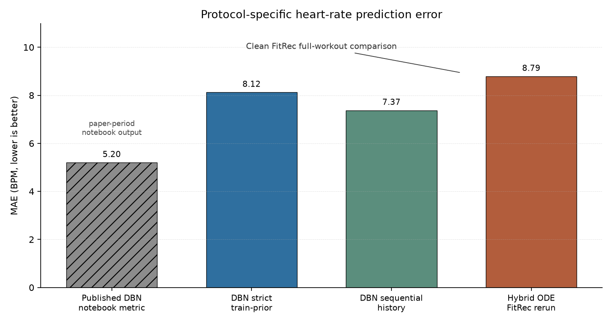
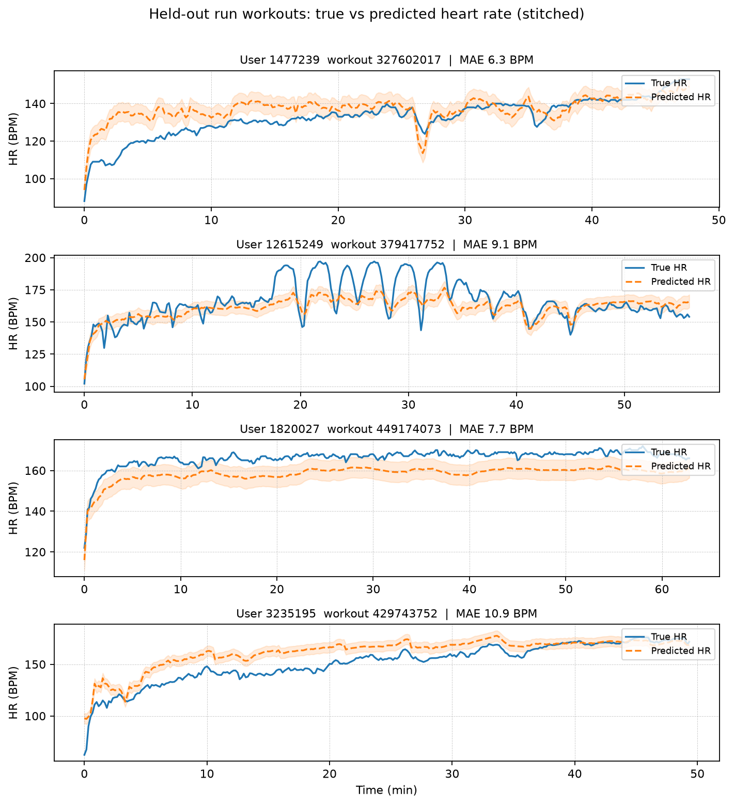
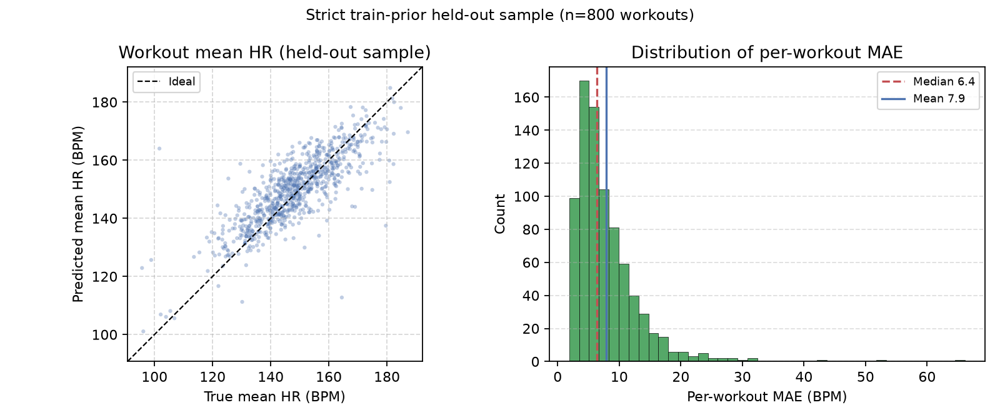
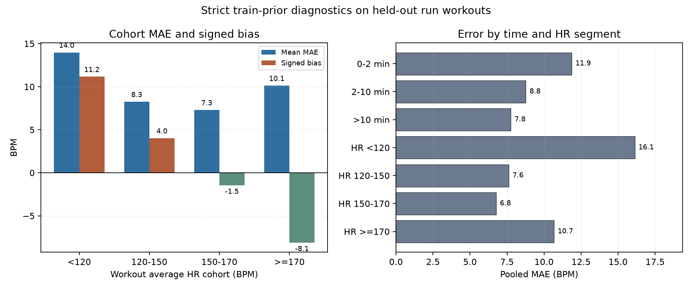

# Heart Rate Modeling for Personalized Fitness

This package predicts heart rate (HR) from workout time series.
The data format is FitRec / Endomondo.

## Reference paper

Kayange, H.; Mun, J.; Park, Y.; Choi, J.; Choi, J.  
*A Hybrid Approach to Modeling Heart Rate Response for Personalized Fitness Recommendations Using Wearable Data.*  
*Electronics* **2024**, *13*, 3888.  
https://doi.org/10.3390/electronics13193888

Post-publication technical notes: [`FINDINGS.md`](../../FINDINGS.md) (repository root).

---

## 1. Purpose of this package

This package does three things:

1. It keeps the original training artifact from the paper period.
2. It gives explicit **reevaluation protocols** for held-out tests.
3. It lets you train and compare model variants under those protocols.

**Note:** The published MAE of **5.2 BPM** and the MAE from the reevaluation protocols are **not** the same metric under the same conditions. Section 2 states the difference.

This README is written as a reproducibility record: results are reported only
with the data split, history mode, checkpoint rule, and metric definition used
to produce them.

---

## 2. Published result and reevaluation result

### 2.1 Definitions

| Term | Meaning |
|------|---------|
| **MAE** | Mean absolute error in beats per minute (BPM) |
| **Mean workout MAE** | Mean of per-workout MAE values (primary metric in this package) |
| **Held-out set** | Workouts with `in_train = false` |
| **Validation set** | Last fraction of each user train workouts (for checkpoints only) |
| **Full-workout MAE** | MAE on the full session after stitched windows |
| **Train-prior history** | Validation/held-out workouts use history from `train_fit` workouts only |
| **All-prior history** | Sequential personalization: a workout may use any earlier workout of the same user as history, including earlier validation/held-out workouts |

### 2.2 Comparison

| Item | Published paper | This package (reevaluation protocols) |
|------|-----------------|----------------------------------|
| Headline MAE | 5.2 BPM (abstract, Table 3) | 8.12 BPM strict train-prior; 7.37 BPM sequential-history |
| RMSE | 8.1 BPM | 11.19 BPM strict train-prior pooled; about 10.5 BPM sequential pooled |
| Test set | See notebook procedure in Section 2.3 | Held-out rows for final scoring (`~in_train`) |
| Checkpoint selection | Same loader as the reported test path | Validation set only (`--val-fraction`) |
| Prediction length | First training window (64 steps ≈ 10.7 min in the notebook) | Full workout (stitched) as primary metric |
| Physiological head (Eq. 9) | Described as a main part | Optional; **not** active in the original trained path |
| AdaFS | Described as a main part | Optional; **not** active in the original trained path |
| Path in the released checkpoint | Hybrid description in the text | Transition LSTM → linear emission |

### 2.3 Origin of the 5.2 BPM figure

1. The notebook `examples/model_eval.ipynb` recorded **MAE ≈ 5.07 BPM**.
2. The paper states an average of **5.2 BPM**.
3. That run used a simple emission path (no AdaFS, no Eq. 9 in the forward path of the saved checkpoint).
4. The saved notebook outputs match a test loader that used almost all data, not only the held-out set.
5. The metric used the first prediction window (64 steps), not the full session.

**Conclusion:** 5.07 / 5.2 BPM is a real script output. It is **not** a held-out full-workout result under the reevaluation protocols in this package.

### 2.4 Protocol-specific reevaluation numbers

| Configuration | Result (approx.) | Notes |
|---------------|------------------|--------|
| As-published path (linear emission) | 9.4 BPM MAE | Held-out, short horizon style |
| As-described (legacy AdaFS + physio) | 10.3 BPM MAE | Held-out, short horizon style |
| Strict train-prior engineering stack | **8.12 BPM** mean workout MAE | Full workout, val checkpoints, history from `train_fit` only |
| Sequential-history engineering stack | **7.37 BPM** mean workout MAE | Full workout, val checkpoints, sequential all-prior history |
| Paper-faithful stack (`--paper-faithful`) | **7.42 BPM** mean workout MAE | Full workout; Eq. 9 + paper AdaFS; sequential all-prior history |
| Hybrid ODE baseline on FitRec | **8.79 BPM** mean workout MAE | Same held-out FitRec workouts; full workout; val checkpoint |

Do not treat 5.2 BPM as the target for these reevaluation protocols.

Details and evidence: [`FINDINGS.md`](../../FINDINGS.md).

### 2.5 Clean same-dataset comparison against Hybrid ODE

The paper's Table 3 compares the DBN result with a 6.1 BPM Hybrid ODE result
from the cited Apple/Nazaret study. This repository additionally reruns the
Hybrid ODE code on the same FitRec data used by the DBN reevaluation.

| Model | Protocol | Mean workout MAE | Median workout MAE | Pooled MAE | Pooled RMSE |
|-------|----------|-----------------:|-------------------:|-----------:|------------:|
| DBN engineering stack | Strict train-prior, run workouts, held-out full workout | 8.12 BPM | 6.70 BPM | 8.04 BPM | 11.19 BPM |
| Hybrid ODE baseline | FitRec run workouts, held-out full workout | 8.79 BPM | 7.12 BPM | 8.61 BPM | 12.37 BPM |

This supports the protocol-specific statement: **under the clean FitRec
full-workout reevaluation, the DBN model outperforms the rerun Hybrid ODE
baseline**. It should not be stated as "5.2 beats 6.1 on the same clean
protocol," because those numbers came from different evaluation contexts.

---

## 3. Public figures

**Location:** `examples/figures/public/`

Captions: [`FIGURES.md`](examples/figures/public/FIGURES.md).

### 3.1 Protocol-specific MAE comparison

Published notebook output and clean FitRec held-out full-workout results are
shown together with protocol labels. The first bar is included for provenance;
the clean comparison is DBN strict train-prior vs Hybrid ODE FitRec rerun.



### 3.2 True vs predicted heart rate (held-out)

Stitched full-session predictions on held-out run workouts. Model: strict train-prior engineering stack. The band is ±5 BPM for display only.



### 3.3 Error summary (held-out sample)

Left: predicted mean HR vs true mean HR. Right: distribution of per-workout MAE.



### 3.4 Cohort and segment diagnostics

The strict train-prior model is strongest in the mid-HR range and remains biased
toward the population mean for unusually low-HR and high-HR workouts. These
diagnostics define the next research target.



### 3.5 Figure files

| File | Content |
|------|---------|
| [`01_mae_comparison.png`](examples/figures/public/01_mae_comparison.png) | Figure in Section 3.1 |
| [`02_workout_predictions.png`](examples/figures/public/02_workout_predictions.png) | Figure in Section 3.2 |
| [`03_error_scatter.png`](examples/figures/public/03_error_scatter.png) | Figure in Section 3.3 |
| [`04_cohort_bias.png`](examples/figures/public/04_cohort_bias.png) | Figure in Section 3.4 |

**Rebuild figures** (needs `reeval/run-huber-128-delta12-intensity-trainprior-val/best_model.pt`):

```bash
cd examples
python3 plot_public_figures.py \
  --name run-huber-128-delta12-intensity-trainprior-val \
  --no-paper-faithful \
  --physiological --residual \
  --sport run \
  --history-source train-prior \
  --seq-length 128 \
  --feature-set run_intensity
```

---

## 4. Open-loop results

### 4.1 Strict train-prior protocol

**Run directory:** `examples/reeval/run-huber-128-delta12-intensity-trainprior-val/`

| Metric | Value |
|--------|------:|
| Mean workout MAE | 8.12 BPM |
| Median workout MAE | 6.70 BPM |
| Pooled MAE | 8.04 BPM |
| Pooled RMSE | 11.19 BPM |
| Held-out run workouts | 6,396 |
| Time steps (full) | 2,191,034 |

**Configuration:** same engineering stack as Section 4.2, but with
`--history-source train-prior`. Validation and held-out workouts use only
`train_fit` workouts as history.

Main diagnostic pattern:

| Cohort / segment | Error |
|------------------|------:|
| Average HR <120 cohort | 13.98 BPM mean MAE; +11.16 BPM bias |
| Average HR >=170 cohort | 10.13 BPM mean MAE; -8.12 BPM bias |
| HR <120 segment | 16.13 BPM pooled MAE |
| HR >=170 segment | 10.68 BPM pooled MAE |

### 4.2 Sequential-history protocol

**Run directory:** `examples/reeval/run-huber-128-delta12-intensity-val/`

| Metric | Value |
|--------|------:|
| Mean workout MAE | 7.37 BPM |
| Median workout MAE | 5.99 BPM |
| Pooled MAE | 7.27 BPM |
| Pooled RMSE | 10.54 BPM |
| Held-out run workouts | 6,396 |
| Time steps (full) | 2,191,034 |

**Configuration:**

- Sport: run only  
- History: sequential all prior workouts in time order (`all-prior`)  
- Sequence length: 128; train stride: 64  
- Physiological head: on  
- Residual: on  
- AdaFS: off  
- Features: `run_intensity`  
- Loss: Huber (delta = 12); weight decay = 1e-4  
- Validation fraction: 0.15 (per user, from `in_train` only)  

---

## 5. Evaluation protocols

Use one of these protocols for all new reported numbers, and name it explicitly.

1. **Train set:** Chronological subset of `in_train` for each user.  
2. **Validation set:** Last fraction of each user train workouts (`--val-fraction`). Use this set only for checkpoints and learning-rate schedule.  
3. **Held-out set:** All workouts with `in_train = false` (optional sport filter). Report metrics only on this set at the end.  
4. **Primary metric:** Stitched full-workout mean MAE, median MAE, and pooled MAE (BPM).  
5. **Secondary metrics:** First-window MAE; cohort tables from `analyze_errors.py`.  
6. **Rule:** Do not use held-out heart rate for training, calibration, or checkpoint selection.

History modes:

| Mode | Flag | Meaning |
|------|------|---------|
| Strict train-prior | `--history-source train-prior` | Validation and held-out workouts use only `train_fit` workouts as history. This is the strictest default for new claims. |
| Sequential all-prior | `--history-source all-prior` | Later validation/held-out workouts may use earlier chronological workouts from the same user as history. This is sequential personalization, not checkpoint/training leakage. |
| Split-only | `--history-source split` | Histories are built only inside the evaluated split; kept mostly for ablation/debugging. |

The strict train-prior result is 8.12 BPM mean workout MAE. The 7.37 BPM table
was produced with `all-prior` and should be described as sequential
personalization.

---

## 6. Install

Do these steps from the `Heart_Rate_Modeling/` directory.

```bash
python3 -m venv .venv
source .venv/bin/activate
pip install torch pandas pyarrow numpy tqdm pytest
```

**Data path:**

- Put preprocessed data in `output/endomondo_filtered.feather`.  
- Build the file with `examples/preprocess.py` from `endomondoHR_proper.json` if needed.

Use a GPU for full training if available.

---

## 7. Train and evaluate

### 7.1 Engineering stack, strict train-prior

```bash
cd examples

python3 run_reeval.py \
  --name my-run \
  --physiological --residual \
  --sport run --history-source train-prior \
  --seq-length 128 --train-stride 64 \
  --feature-set run_intensity \
  --loss huber --huber-delta 12 --weight-decay 1e-4 \
  --val-fraction 0.15 --full-workout --epochs 100
```

Use `--history-source all-prior` only when you explicitly want the
sequential-history personalization protocol.

### 7.2 Paper-faithful stack (text of the paper)

This mode turns on Equation 9 and paper AdaFS (Section 4.4: controller on latent z).

```bash
cd examples

python3 run_reeval.py \
  --name paper-faithful-run-val \
  --paper-faithful \
  --sport run --history-source all-prior \
  --seq-length 128 --train-stride 64 \
  --feature-set basic \
  --loss huber --huber-delta 12 --weight-decay 1e-4 \
  --val-fraction 0.15 --full-workout --epochs 100
```

### 7.3 Main flags

| Flag | Function |
|------|----------|
| `--physiological` | Use Equation 9 emission head |
| `--residual` | Add linear residual on the physiological head |
| `--adafs` | Turn on adaptive feature selection |
| `--adafs-variant legacy` | Old controller on flattened T×F input |
| `--adafs-variant paper` | Paper Section 4.4 controller on latent z |
| `--paper-faithful` | Equation 9 + paper AdaFS |
| `--personalized-physio` | Subject-stable bounds and intensity with embeddings |
| `--feature-set basic` | Horizontal and vertical speed only |
| `--feature-set run_intensity` | Extra run intensity features |
| `--feature-set run_personal` | Subject prior and relative speed features |
| `--history-source train-prior` | Strict history from `train_fit` only |
| `--history-source all-prior` | Sequential personalization from all chronological prior workouts |
| `--val-fraction` | Share of each user train workouts for validation |
| `--full-workout` | Report stitched full-workout metrics |
| `--eval-only` | Load `reeval/<name>/best_model.pt` and evaluate only |

### 7.4 Error analysis

```bash
python3 analyze_errors.py \
  --name run-huber-128-delta12-intensity-trainprior-val \
  --physiological --residual \
  --sport run --history-source train-prior \
  --seq-length 128 --feature-set run_intensity
```

---

## 8. Ablation study

Existing ablations use the sequential-history protocol: run sport, `all-prior`
history, val fraction 0.15, sequence length 128, Huber delta 12. Use
`--history-source train-prior` for strict future claims.

```bash
cd examples
python3 run_clean_ablations.py
python3 summarize_ablations.py
```

Results file: [`examples/reeval/ABLATION_TABLE.md`](examples/reeval/ABLATION_TABLE.md).

| Ablation | Purpose |
|----------|---------|
| Linear emission | Path of the original trained checkpoint |
| Physiological head only | Equation 9 without residual |
| Physiological head + residual | Core improved head |
| + `run_intensity` | Best engineering feature set |
| + AdaFS | Test adaptive feature selection |
| + `run_personal` | Subject-relative features |
| + personalized physio | Bounds and intensity from embeddings |
| + mean-bias loss | Extra loss on workout mean error |

**Note:** Paper Table 4 is not a true ablation of the released checkpoint. AdaFS and personalized scalars were not active in that trained path.

---

## 9. Directory layout

```text
Heart_Rate_Modeling/
  Model/
    dbn.py                 # Model, physiological head, AdaFS
    data.py                # WorkoutDataset
    trainer.py             # Training; validation checkpoints
    activity_features.py   # Feature sets
    modules_*.py
  examples/
    run_reeval.py          # Main train and evaluate entry
    run_clean_ablations.py # Ablation runner
    summarize_ablations.py # Build ABLATION_TABLE.md
    analyze_errors.py      # Cohort and worst-workout analysis
    preprocess.py          # FitRec JSON to feather
    model_eval.ipynb       # Notebook from the paper period
    plot_public_figures.py # Build figures for the public package
    figures/public/        # Public PNG figures and FIGURES.md
    reeval/<name>/         # Checkpoints and result.txt
    best_model.pt          # Original paper-period checkpoint
  tests/
  output/                  # Preprocessed data (local)
```

---

## 10. Tests

```bash
cd Heart_Rate_Modeling
python3 -m pytest tests/ -q
```

`tests/test_forward_paths.py` checks that each active head receives gradient.

---

## 11. Original trained path

Default configuration:

- `use_adafs = false`  
- `use_physiological_head = false`  

This matches `examples/best_model.pt` (linear emission).

```bash
cd examples
python3 run_reeval.py --name as-published-check --eval-only
```

Use a checkpoint that you trained without `--physiological` and without `--adafs`.

---

## 12. Hybrid ODE baseline (FitRec)

Location: `baselines/ml-heart-rate-models-main/`

That code supports FitRec / Endomondo. The published Hybrid ODE MAE of 6.1 BPM in Table 3 of the paper uses Apple study data, not FitRec.

Completed clean FitRec rerun:

| Metric | Value |
|--------|------:|
| Validation MAE | 7.75 BPM |
| Mean workout MAE | 8.79 BPM |
| Median workout MAE | 7.12 BPM |
| Pooled MAE | 8.61 BPM |
| Pooled RMSE | 12.37 BPM |
| Held-out run workouts | 6,396 |
| Time steps (full) | 2,191,034 |

Result file:
`baselines/ml-heart-rate-models-main/examples/reeval_ode/ode-run-clean-val/result.txt`

For a FitRec run under the clean validation/held-out protocol:

```bash
cd ../../baselines/ml-heart-rate-models-main

/home/cyai/.venvs/xr-hr-p2/bin/python examples/run_ode_fitrec_clean.py \
  --name ode-run-clean-val \
  --sport run \
  --val-fraction 0.15 \
  --epochs 50 \
  --full-workout
```

More detail: [`baselines/ml-heart-rate-models-main/FITREC_CLEAN.md`](../../../baselines/ml-heart-rate-models-main/FITREC_CLEAN.md).

ODE training is much slower than the DBN model (ODE solver on each batch).

To recompute metrics from an existing ODE checkpoint without retraining:

```bash
cd ../../baselines/ml-heart-rate-models-main/examples

/home/cyai/.venvs/xr-hr-p2/bin/python -u run_ode_fitrec_clean.py \
  --name ode-run-clean-val \
  --eval-only
```

---

## 13. Citation

```bibtex
@article{kayange2024hybrid,
  title={A Hybrid Approach to Modeling Heart Rate Response for Personalized Fitness Recommendations Using Wearable Data},
  author={Kayange, Hyston and Mun, Jonghyeok and Park, Yohan and Choi, Jongsun and Choi, Jaeyoung},
  journal={Electronics},
  volume={13},
  number={19},
  pages={3888},
  year={2024},
  publisher={MDPI}
}
```

If you cite numbers from this package, state the protocol:

- held-out set only  
- validation checkpoints  
- full-workout mean MAE  

Do not mix those numbers with the published 5.2 BPM figure without a clear note.

---

## 14. Support

This work received support from IITP / MSIT, Republic of Korea  
(Project No. 2022-0-00218, *XR Twin-based Rehabilitation Training Content Technology Development*).
